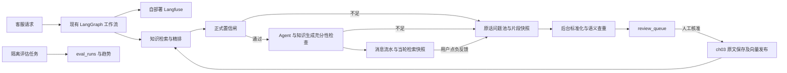

# Ch09 · 可观测性与数据飞轮设计

日期：2026-10-08，时区 Asia/Shanghai。状态：用户已分别批准后端总体方案与本书面设计；实施计划已编写并待审。尚未开始产品代码、依赖安装或数据库迁移。

## 1. 目标与已确认约束

给客服请求增加可查看的完整链路，并让答不好的问题进入人工补知识闭环。成功标准是：请求能在自部署 Langfuse 展开；知识缺口和负反馈带原话、当轮证据进入待审；人工核准并发布后同问能答；有按意图的 token 汇总和两轮真实评估趋势。

固定使用现有 FastAPI、SQLAlchemy/MySQL、LangChain/LangGraph、BGE-M3、Milvus 原生 BM25/hybrid/RRF、bge-reranker-v2-m3，以及开源自部署 Langfuse。沿用现有模型供应商配置，不引入云端链路平台或主题微调分类器。

用户提供的 review_queue、eval_runs、low_confidence_questions 两列及外键 DDL 是基础契约，保留列长度、中文 ENUM、索引、InnoDB/utf8mb4 和 ON DELETE SET NULL。用户已明确批准必要补充：消息表保存当轮检索快照，问题池枚举扩展用户反馈入口。

用户以「我已确认」批准了“先落池、后台标准化查重”的总体方案：置信闸位置不变；20条校准题确定参数、40条测试题独立验证；通过复用 ch03 发布流程；评估保持数据隔离。该答复不代替书面 spec 和计划审核。

后端代码按 Superpowers/TDD；Prompt、语义查重、置信校准与模型行为用冻结标注样例/评估验证。前端按 Vibe Coding 直接实现，前端不套 brainstorming、TDD 或独立 code review。本文件的页面内容仅说明后端合同和验收行为，不规定视觉设计。

## 2. 现状与边界

当前应用在 ch02-tools linked worktree，后端基线为72af81f。已有未提交的 Ch08 工单预览 HTML/DOM 脚本和其他章节笔记，不能重置、混合提交或宣称这些内容已完成页面验收。

现有入口：

- ch05/workflow.py 的 retrieve_knowledge → confidence_gate → Agent；现闸只看最高精排分与旧校准阈值。
- knowledge/refusals.py 的独立持久化问题池；entry_point 为 chat_stream/agent/cli，trigger_stage 为 retrieval/generation。
- knowledge/answering.py 的 AnswerAssessment 和生成拒答已经落池；主力工作流的流式知识回答需要接入同一个生成充分性合同，不能仅升级旧 Ch02 路径。
- messages.citations 保存展示引用，没有完整评分，拒答时还会清空；聊天页 answer_id 是本地随机号，不能作为后端轮次凭据。
- ch03 的 put_chunk → 提交原文 → sync_pending → 已发布，以及原有向量补偿机制。
- eval/ch04 的80条示例原文、60题，固定20 calibration/40 test；这些示例禁止导入线上知识库。

选服务内后台工作器：原话提交是可靠接收，模型标准化/查重不延长客服响应。与同步方案相比，多了未处理记录恢复；与独立消息中间件/外部 worker 相比，本章不增加额外队列基础设施。单个服务内 worker 是运行方式，数据库锁与事务才是多进程防重边界。

实施在独立工作树和 Ch09 运行环境中进行，保留当前9020供用户测 Ch08。新工作树继承本设计提交和必要的 Ch08 预览代码快照，记录来源/hash；不带入无关章节笔记。Ch09 客服使用9030、独立 checkpoint；两个业务 MCP 仍复用9021/9022。最终实际工作树路径在计划执行时记入笔记。

## 3. 模块与数据流

新增 ch09 边界，责任分为 observability、snapshots/feedback、confidence/calibration、flywheel/reviews、evaluation、migration/config/API。模块通过 DTO、session factory 和已有知识发布接口协作，不让每个入口自行实现查重、计数或发布。

问题池收到的是入口事件，待审队列是一行一个未解决的去重缺口。只有当前待审问题参与自动归并；通过或驳回的历史行不自动改回待审，也不被模型改写核准答案。

## 4. Langfuse 部署与链路合同

### 4.1 部署和版本

采用 Langfuse 服务端 v4.54.0、Python SDK4.17.0，分别由2026-10-08官方 release 页面及 PyPI 元数据核对；独立版本号不要求相同。现有框架实测为 langgraph1.2.12、langchain-core1.6.5、langchain-openai1.6.6、SQLAlchemy2.1.1、FastAPI0.141.1、pymilvus2.6.17，实施不得为接观测而静默升级/替换这些框架。

独立 Compose 项目部署官方 web/worker、PostgreSQL、ClickHouse、Redis、MinIO，网络和数据卷与客服/MySQL/Milvus分开；只对宿主回环发布 web3039，其余依赖走内部网络。沿用官方 Compose 依赖关系，锁定实际镜像版本/digest，关闭 TELEMETRY_ENABLED，不公开管理数据库端口。

本地初始化脚本生成组织、项目、用户和随机凭据，保存到忽略的本地环境文件；LANGFUSE_PUBLIC_KEY/SECRET_KEY 与初始化项目一致，LANGFUSE_BASE_URL 显式为本地3039。凭据不写进 spec、日志、trace、测试产物或 Git。启用 Ch09 观测而配置缺失/仍指向 Langfuse Cloud 时启动报明确配置错误，不回退云端。

本机约15.2GB内存；实施先验证完整部署和已有依赖共存。评估共享服务内已加载的本地模型，避免另起常驻模型副本。实际镜像不可用、SDK与固定栈冲突或资源不足导致不能运行时，记录证据并问用户，不降级云端或换选型。

### 4.2 回调与请求关联

生命周期初始化一次客户端和 CallbackHandler；主图在 compile 完成后 with_config 固定 callbacks。不在每轮、每个节点重新创建回调。在线 JSON、SSE、新消息自动取消、订单选择恢复、工单确认/取消均进入独立的请求观测上下文。

每个请求有自己的 trace_id、session_id、conversation_id、turn_id、entry_point、trace_kind、状态与最终 intent。trace_id 取当前请求上下文，不读共享 handler.last_trace_id。并发会话不能互串 root、intent 或 usage。

人工等待时结束该请求 trace，状态 waiting；resume 创建新 trace，用同一 turn_id 和 origin_trace_id 关联原请求，不让 span 跨越等待/服务重启。分类前意图未确定；分类后更新根 trace 的最终 intent，无法分类明确归其他。成本汇总按根 trace 的最终意图回溯所有生成子节点，因此理解/分类阶段的开销也计入。

LangGraph 节点与 LangChain 模型调用由官方回调形成层级；普通 Python 检索/精排阶段和统一工具引擎补有输入/输出的子 observation。节点不能只有名字而没有实际 prompt、检索/工具数据。保留工具来源、call_id、参数、校验/权限拒绝、结果、重试与超时；不得只采成功的 handler。

生产使用的旧 Ch02/RAG 入口复用同一观测边界，生成拒答也可追踪；遗留纯内存 Ch01 请求记录实际模型链路，未经过正式分类的请求标未分类，不猜意图，也不为了观测增加业务数据库依赖。本章聊天页及六项验收使用现有 Ch05 工作流。

SDK出口和所有查询只指向自部署地址。短命 CLI 收尾 flush，服务关闭收尾导出；服务暂不可用时记录观测故障并保持客服可用，不能伪称该期间 trace 完整。健康恢复后以实际导出和服务端读取证明链路，不拿 SDK“已入本地队列”当界面成功。

### 4.3 token 花销

统计时间窗口内 chat trace 的请求数、真实 input/output/total tokens、每请求均值，按最终 intent 排序，并可按模型区分。缓存细分只有上游真实给出时展示。只求和 generation 叶子用量，不再叠加父 span 的聚合；请求重试产生的实际模型消耗应保留。

已有 TokenUsage 的 estimated 用于预算保护，不能当真实账单。缺 usage 时计 unknown_usage_count，展示实测覆盖率，不填0或用UTF-8字节冒充 token。金额只有配置了对应模型真实价格才展示；本章必要验收是按意图 token 表。

flywheel、evaluation 后台任务单独 trace_kind 展示消耗，不污染客服意图比较。所有查询完整分页，带明确时间范围和导出延迟说明；上游查询失败返回错误，不返回空统计伪装“没花钱”。

GET /api/ch09/token-costs 接收 from/to 时间窗口，按 [from,to) 查询，返回每类 intent 的 request_count、input/output/total_tokens、unknown_usage_count、usage_coverage 和可选模型细分，以及统计口径和数据更新时间。查询时间和持久化时间统一 UTC，页面显示 Asia/Shanghai；未知用量和实测0有明确区别。

## 5. 数据结构与迁移

先原样建 review_queue，再建 eval_runs，最后给 low_confidence_questions 添加 retrieved_chunks、matched_review_id、索引及外键，全部 SET NAMES utf8mb4。保留用户指定的 review_status/triggered_by 中文 ENUM、默认值和 ON DELETE SET NULL。

已批准的补充：

1. messages 增加 retrieval_snapshot JSON NULL，一列封装该回答的检索、身份关联与反馈标记。
2. 问题池 entry_point 增加 feedback；trigger_stage 增加 feedback；reason_code 允许 user_feedback，原枚举值保留。

不另建反馈表或模型任务队列表。matched_review_id=NULL 是后台待处理来源；处理异常留原话，不伪造已归并标志。occurrence_count 统计实际归并的池事件数，同一次👎重试不增加事件；同轮拒答和随后👎是两个不同入口事件，人工详情能区分，次数不宣称独立客户数。

迁移幂等：读实际结构，核对同名列/表/索引/外键；兼容的已有对象不重建，不兼容结构明确失败。保存迁移前结构证据，使用真实 MySQL SHOW CREATE/ENUM 中文值核对，不以 SQLite create_all 代替 MySQL DDL 验收。审计表继续遵守 Ch08 无外键及审计故障不拦工具的规则。

### 5.1 快照格式

本章新落池事件的 retrieved_chunks 为 NULL，**仅用于能确定该轮未检索的情况**。其他情况为版本化 JSON envelope：state 为 captured/empty/legacy_partial/unavailable，包含 chunks、检索问句/过滤、TopK及置信信息。检索过但召回0条用 empty + chunks=[]；历史无法恢复用 unavailable + 明确原因，不能冒称未检索。迁移新增列会使旧池行暂为 NULL，详情页须将这种尚未恢复的历史值显示为“旧记录未保存”，不能套用新事件的“未检索”含义；后台只从明确绑定的同轮证据恢复，无法恢复则保存 unavailable。

chunks 默认保存实际精排 Top5的完整原文，不为快照再次查询当前知识库。每条有 rank、chunk_id（十进制字符串）、text、questions、answer、section_path、content_hash、relevance_score。分数直接来自本轮精排；旧引用能回捞原文而无评分时标 legacy_partial、score=null，不重跑检索伪造“当时”的分数。来源展示顺序和 prompt 重排不得改变真实 rank。

messages.retrieval_snapshot 的 envelope 还保存 turn_id、原用户消息的幂等 event_key/持久ID、intent、retrieval_performed、retrieval events、当前池事件ID、trace_id、answer_status及 feedback_lcq_id。answer_status标识完成、等待或错误，防止历史预览卡被误当最终回答。业务/闲聊可存 envelope，但其中 retrieved_chunks=null、retrieval_performed=false；这样仍能关联原问题并记录一次反馈。

不可变证据与身份随本轮消息事务提交；feedback_lcq_id 是后续可变标记。消息幂等比较只比较不可变部分，反馈后重放原回答不能误报内容冲突或覆盖反馈。请求trace_id变化也不构成回答内容冲突：保留首次成功写入的消息溯源，新重放trace用origin/replayed关联。普通 JSON 字段整对象赋值保存更新，不依赖未跟踪的原地修改。

## 6. 正式置信检查

只升级通用知识闸，仍在知识检索后、Agent前。Ch06完整政策检索/售后资格合同保留；它的召回同样记录快照，但不把通用 FAQ 校准直接套到政策资格结论。

对去重后的实际精排 TopK（默认5）计算：s1=Top1 sigmoid 分；有Top2时 gap=s1-s2，否则 gap=0并保留缺Top2标志；n(c)=评分不低于证据有效门槛c的条数。特征均基于原精排名次，有限且在[0,1]的真实分数；非法/缺失分数是检索配置故障，不包装成知识不足。

评分采用可解释单调组合：confidence=w_s*s1+w_n*n(c)/K+w_g*gap。候选权重非负、总和1、步长0.25，w_s至少0.5；校准可把无益信号权重置0，不强迫数量/分差惩罚单篇足够的证据。c候选来自20条校准题的实际评分；放行阈值候选来自对应置信分，并包含高于最大分的全拒候选。

全部候选只用20条 calibration，按误放最少、误拒最少、并列更高阈值以及固定参数顺序确定结果。保留各候选/最终误放误拒、覆盖率、三项特征、完整实际召回及模型/config/dataset/source hash，不凭人工定线上阈值。无证据直接拒答；上下文超限继续按现有预算闸处理。

校准检索调用与 Ch05 正式 retrieve_knowledge 路径一致，输入为完整原问题和该题可信过滤，不能复用 Ch04 另一套 query rewrite 后的分数冒充。40条 test 不参与调参。若最优为全拒，结果明确展示；不能改标签/手调阈值遮住，也不能在这种状态宣称闭环验收通过。

校准文件绑定冻结评估语料、实际模型revision、评分实现及检索/TopK配置；不把线上知识库不断增长的 hash 当成固定评估 corpus hash。人工发布普通 FAQ 不要求重启服务或重做校准。模型、评分逻辑或检索配置改变须生成新产物；旧来源不匹配时明确失败。

## 7. 三个落池入口与反馈

检索闸拒绝先独立提交原话、source_conversation_id、入口/阶段/原因和快照，再给统一兜底。生成充分性检查复用 ch04 的 AnswerAssessment、原拒答原因和池写入边界，主力知识回答也走该合同；不是只把旧拒答表接后台而让新工作流绕开。

知识类正常回答在最终生成时一次产生“充分性判断+带引用答案”，不足则回统一兜底并落 generation；不在普通答案之后额外请求一次模型评分。未验证的知识正文不先发 token；参数追问、业务事实回复和售后已确定资格仍遵守原对应合同。新增或改动的生成 Prompt、拒答/引用语义须用标注样例验证，并纳入现有 token/时间预算。

已通过正式置信闸的本轮证据传入复用的生成接口时关闭其旧 score-only 门控（apply_relevance_gate=False），保留上下文、充分性与引用检查；不让旧阈值形成第二道不一致的置信闸，也不允许没有正式检查的知识请求借此跳过门控。

新增 POST /api/ch09/feedback，只接 user_id、session_id、answer_message_id和choice=down；前端不提交“原问题”或“检索片段”作为事实来源。复用会话归属检查，锁定持久化 assistant 最终回答，找到明确绑定的原 user 消息，后端读取原话和快照。

同一回答的负反馈重复点击、网络重试或刷新后重发，返回同一 pool ID。创建问题池行与更新消息反馈标记在同一事务；并发点击只增一条。错误/未完成/工单等待预览不具备可反馈的最终回答ID；账本未提交时不能伪造可持久反馈ID。

新回答和历史加载响应返回 answer_message_id（字符串）与反馈状态；本地随机 answer_id只用于页面渲染。新轮开始时清空本轮检索状态，业务/闲聊不继承上一轮证据。

旧持久回答缺快照时按同轮绑定查 checkpoint历史、旧持久引用。只认明确对应本次回答/turn的记录，不能拿最后一个checkpoint、重跑当前检索或猜测重复问句归属；恢复不全按第5节标部分/不可恢复。真实从未检索才 NULL。

## 8. 标准化、语义查重与后台恢复

原话入池不等待模型。lifespan 启动 worker，按未归并ID分页扫描，收到新事件唤醒，重启重新扫描；模型失败不删除原话。处理完一页继续后续记录，不能让第一条失败永久饿死后续记录。临时网络/上游故障采用有上限的退避，同一记录在一次服务运行中最多自动尝试3次，之后等待人工重试；非法模型结构和越界候选不进入无限重试。重启恢复仍只认数据库中的未归并记录，每次恢复执行也有上述上限。后台使用独立 session factory，不复用已结束HTTP请求的 Session/ORM对象。

标准化模型输出 normalized_question（1–512字符）和示例答案草稿。忠实保留型号、数字、否定、条件；上下文消解只用该轮已可信解析的信息，不编客户事实。示例答案根据片段可核实的内容作草稿，缺依据明确待人工补充，不凭常识虚构价格、时限或政策。所有示例只备查，不能自动写知识库。

语义查重逐页比较当前待审问题，只提供候选ID和标准化问句，不加入主题分类器。页面大小受已校验的输入预算控制，默认最多8候选，超预算缩页；不能因超预算悄悄跳过后续待审队列。否定/条件/型号不同、有冲突或无法确定同义时不合并。若多页同义，确定性选择最早ID，并记录模型依据。

每个处理周期用数据库连接级命名锁协调 worker；持锁连接断开即释放。本章不在长数据库事务里等待模型。拿锁后读取候选、调用模型，再开启短事务锁原话/目标行，重新检查matched_review_id和目标仍待审：已处理直接跳过；目标已被人工审核则重新查重，不归入终态行。

命中后原子累加 occurrence_count 并回写matched_review_id；未命中插入新review（count1）并回写。两步同一事务，崩溃/重跑不重复累计。相同语义的并发新原话不能创建两个待审行；“本进程队列串行”不作为唯一防重证据。

模型非法结构/越界候选ID/服务故障均留原话未归并并记录处理错误。人工管理页可看到待处理数和错误/重试入口；不能把空队列解释为无知识缺口。未归并积压是持久事实，本次尝试状态/错误来自工作器诊断和日志，重启后不宣称保留了未入库的尝试状态，不因此添加任务表。启动允许处理原有Ch04未归并积压，旧片段恢复状态如实展示。

## 9. 人工审核与知识发布

后台 GET /api/ch09/reviews 支持状态、分页、按次数/时间排序；GET /api/ch09/reviews/{id} 返回标准问题、草稿、次数、状态、核准答案、归并原话及各自入口/时间/不可变片段。详情分页不丢原话。

POST /api/ch09/reviews/{id}/approve 必须收到非空 approved_answer；操作人可编辑示例草稿，服务端不在缺参数时自动代填AI答案。另接明确知识category/product_category，默认category为客服补充FAQ、content_type固定faq；人工元数据不是主题微调分类器。

事务锁待审行，用稳定 source_key=ch09-review:<id>调用已有 put_chunk，并同时保存review_status=通过和核准答案；提交后复用 sync_pending 向当前客服检索集合发布。同一参数重复审批不新增知识；已通过但提交不同答案返回冲突，不静默覆盖；驳回不产生知识，历史通过/驳回不被后台 worker 改写。

API分别返回 review_status、knowledge_id、publication_status（pending/published）与 sync_error。向量化失败时原文和核准答案保留，页面显示已审核但待发布；POST /api/ch09/reviews/{id}/publish 安全重试同一条知识。只有真实 MySQL done和Milvus可检索后显示已发布，不能把收到 HTTP200 当成已能回答。

后台入口面向本地操作人，不注册成模型/MCP可用工具；Ch08写工具权限与工单确认仍由原执行引擎管理。复用当前演示的user_id归属合同，不宣称本章新增生产账户认证系统。

## 10. 自动化评估与趋势

复用 ch04 冻结原文、60题划分、GT、参考答案和指标函数。每轮在独立 SQLite 数据源和 ch04_eval_<run_id> Milvus集合进行，绝不清空/覆盖客服线上集合，或把80条示例原文导入在线知识库。

定期/手动统一执行当前正式 hybrid+精排+知识充分性生成路径；主比较40条test，20条calibration只用于参数校准、单列记录，eval_runs.dataset_size=40。保留原Ch04四策略命令供需要时显式比较，本章两轮不额外强制跑160×2四策略。

精排原Top10计算 Recall@5/10、MRR@10，候选Top50保留原指标；实际给生成的Top5和置信门控配置与线上一致。复用Faithfulness判定与分母定义：无GT/拒答/无事实声明为相应指标NA，不填满分；有GT未召回是0；生成/评分失败单独计错误，不能通过排除故障让曲线假升。

服务内评估 worker 共享已加载的模型但使用隔离数据/index；POST /api/ch09/evaluations 提交run_id和触发方式，返回任务状态地址；GET查询实际进度。每个不同run_id重新检索、生成和评分，不能拿历史summary插两行充两轮。可复用冻结原文的编码缓存；中断后显式resume同一run可恢复本轮已完成步骤，留恢复记录。

每轮保留逐题结果、原文、评分依据、特征/置信/拒答、耗时/错误、数据/模型/配置hash及运行manifest。全部40题处理完后写一行eval_runs；metrics含原指标、每项有效分母、覆盖率、错误数和_meta（run_id、hash、时间、配置、状态）。全部NA或有错误明确显示，CLI非零，不能声称通过。未完成/中断没有“已完成轮次”行。

run_id持久化登记通过数据库命名锁和事务内查重，保证同轮重复收尾只落一次，不依赖进程内dict。不同运行的并行提交被同一评估锁挡住，正在运行时返回现有任务/忙状态，不启动第二副模型任务。

复用项目已有 Windows Task Scheduler 方式，独立任务 MewHelp-Ch09-Evaluation；默认每周日04:00，Asia/Shanghai，频率/时刻可配置。任务调用本地服务的评估提交/轮询脚本，服务不在时真实失败记录，不补造eval行。不得把手动启动定时任务验收说成日历实际触发；交付报告分别记录两轮真实执行和定时任务Enabled/下一触发时间。

趋势 GET /api/ch09/eval-runs 按created_at、id排序，展示每项分数、有效分母与相邻同口径变化；数据/配置不同时标不可直接比较。指标下降用负差和醒目标记，不仅画没有坐标/分母的折线。固定小评估集是回归证据，不代表生产总体效果。

## 11. 页面合同与错误行为

聊天页👎提交后端成功才显示已反馈；失败显示可重试，同一回答不会重复入池。刷新/切会话从持久消息ID及反馈状态恢复。👍沿用原本地采集，不入知识缺口池。纯前端模拟答复不假装拥有后端回答ID。

管理页提供待审列表、可编辑核准答案、通过/驳回，以及展开原话/片段/评分/恢复状态；向量发布失败可重试。统计页提供意图token表及评估趋势。页面实现采用现有风格直接制作，遇到用户视觉反馈再改，不做前端设计审批或独立review。

Langfuse故障只影响观测；标准化/查重故障保留原话；向量发布故障保留pending知识；评估故障保留真实失败/中断产物。问题池本身提交失败沿用现有 PoolCommitError 合同，不能告知用户“已记录”但实际没有数据。

## 12. 验证与六项验收证据

代码TDD聚焦真边界：迁移兼容与中文ENUM/外键；快照不继承旧轮；负反馈归属/并发/重试；反馈后消息重放；worker重启/并发去重/计数；审核与归并竞争；批准/发布部分失败；trace隔离与token不重复；评估同轮防重与中断。使用真实MySQL补并发/命名锁验证，SQLite不能替代。

Prompt/数据冻结标注样例覆盖忠实标准化、否定/型号/数字区别、同义/非同义归并、示例答案不虚构、知识生成充分性和引用。20calibration与40test隔离；评估失败如实保留，不补写标签凑通过。按变更完成所需回归，不重复已无关的Ch08真实模型验收。

| 验收 | 必须保存的真实证据 |
| --- | --- |
| 1. 任意客服请求完整trace | 知识/业务MCP/拒答/确认或取消/并发请求的实际trace_id；自部署界面树与服务端observations中对应prompt、结果、usage、耗时；等待与resume关联 |
| 2. 未知知识进入待审 | 真实兜底响应、池行、matched_review_id及review；管理页原话和本轮完整评分片段；未召回0条明确显示 |
| 3. 人工补知识闭环 | 管理页提交明确核准答案；原文/向量发布证据；同问第二次真实检索命中新知识并正确引用回答；不改核心代码、不重启客服 |
| 4. 👎入池归并 | 对旧回答/切会话后反馈的原话和当轮证据；重复点击/重试只一条；与已有待审同义合并并正确累计；另验闲聊/业务确未检索时NULL |
| 5. 意图token统计 | 自部署Langfuse真实usage与汇总表逐项对照，至少两类意图；全分页/时间窗口/未知usage覆盖率；不以估算冒充实测 |
| 6. 两轮趋势 | 两个不同run_id、各40条test实际检索/生成/判定产物、两条eval_runs、同口径趋势/差值；定时任务真实注册状态单独列明 |

两轮完整模型评估是用户本章明确要求，保留实际消耗和耗时。闭环验收的新知识使用明确标识的演示事实或用户核准内容，不能为验收编造真实业务政策；Ch04示例语料仍只在评估集合。

后端按计划末尾独立审查并处理问题；前端遵守用户Vibe例外。真实页面点击与Langfuse界面验收需要实际结果，DOM/API/数据库检查分别记证据级别；浏览器权限拦截时不换工具/地址绕过，保留待验收并由用户手动提供结果。

每完成brainstorm定稿、计划审核、任务、后端review或finish即追加 dev-notes/ch09.md 四项：用户关键原话、产出/路径/结论、拒绝纠偏、失败返工。最终交付实际启动/演示命令、完整测试和两轮评估结果、dev-notes路径及未解决限制。

## 13. 官方资料核对与当前阶段

2026-10-08已通过 Context7 核对 Langfuse Python/文档、LangGraph、SQLAlchemy、FastAPI、Milvus对应的回调、上下文、事务/行锁、JSON、lifespan和检索接口。一个 Context7 MCP 返回月额度耗尽，已使用同样可用的 Context7 插件接口取得官方内容，没有换成记忆实现。

- [Langfuse官方LangGraph集成](https://langfuse.com/integrations/frameworks/langgraph)：编译图with_config固定回调。
- [Python SDK当前源及API参考](https://github.com/langfuse/langfuse-python)：CallbackHandler、当前trace上下文、嵌套observation与flush；[SDK4.17.0发布元数据](https://pypi.org/project/langfuse/4.17.0/)。
- [服务端v4.54.0](https://github.com/langfuse/langfuse/releases/tag/v4.54.0)、[官方Compose](https://github.com/langfuse/langfuse/blob/main/docker-compose.yml)：部署依赖、初始化和遥测配置。GitHub API匿名额度耗尽时以官方release页面重定向核对，没有声称API成功。
- [FastAPI lifespan](https://fastapi.tiangolo.com/advanced/events/)、[后台任务](https://fastapi.tiangolo.com/tutorial/background-tasks/)：资源生命周期，后台独立数据库Session。
- [SQLAlchemy事务](https://docs.sqlalchemy.org/en/20/orm/session_transaction.html)、[SELECT行锁](https://docs.sqlalchemy.org/en/20/core/selectable.html)、[JSON可变性](https://docs.sqlalchemy.org/en/20/orm/extensions/mutable.html)：不跨模型请求持有事务，显式保存JSON更新。
- [PyMilvus官方API源](https://github.com/milvus-io/pymilvus)：AnnSearchRequest过滤互斥、原生BM25/索引和隔离集合；复用项目当前2.6实现。

实施计划仍须对实际安装版本检查精确接口与依赖兼容，未核对的具体调用先查 Context7 再写。本文已自查并获用户确认；实施计划编写后待用户审阅，沿用此前明确选择的Native，批准计划后才开始实现。
